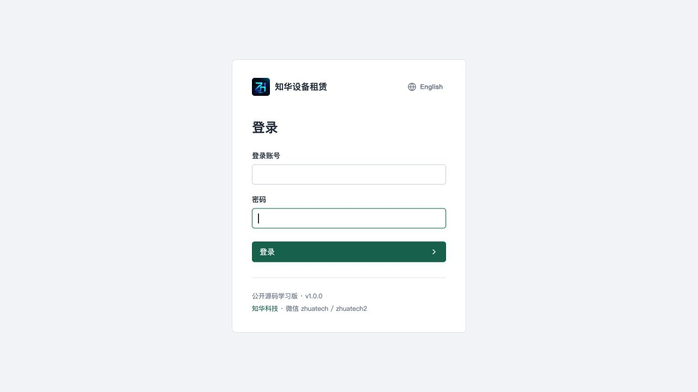
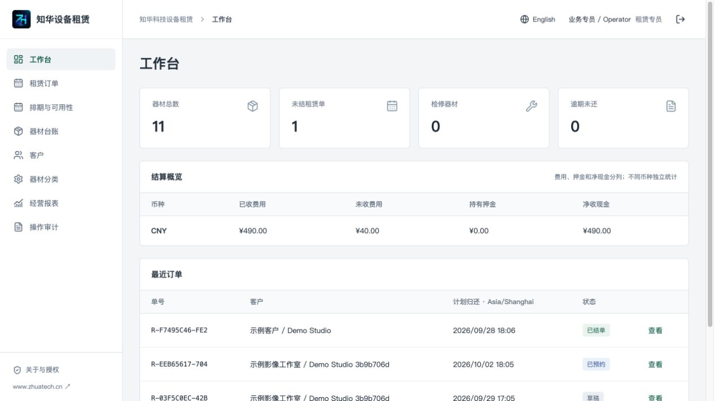
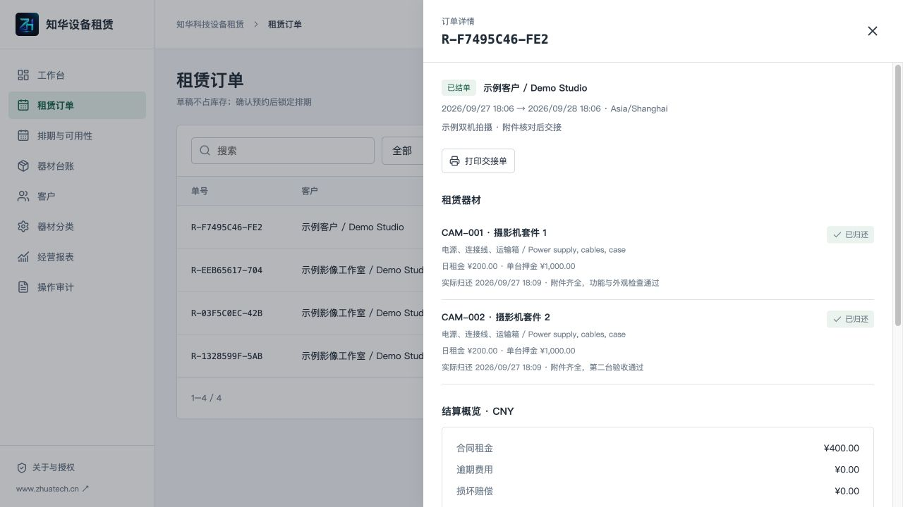
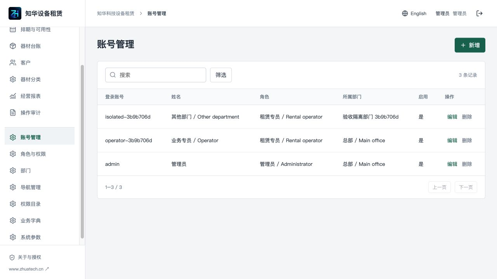
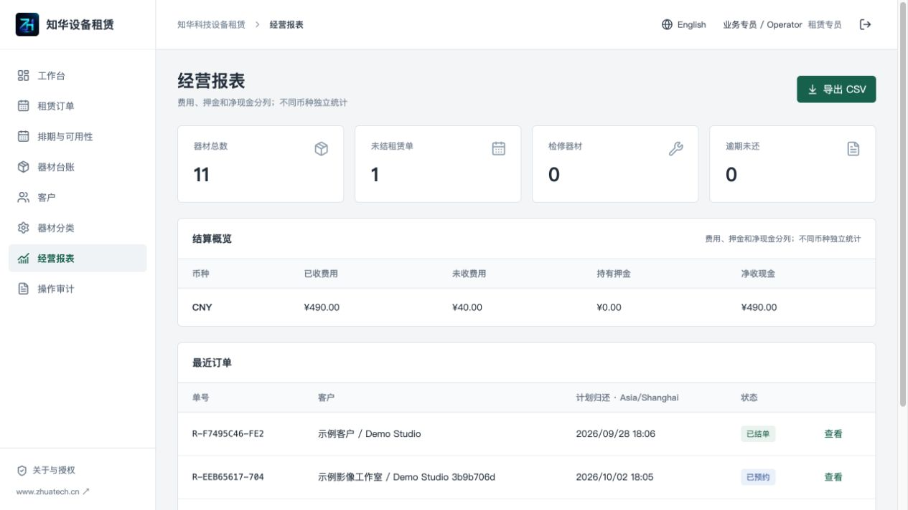
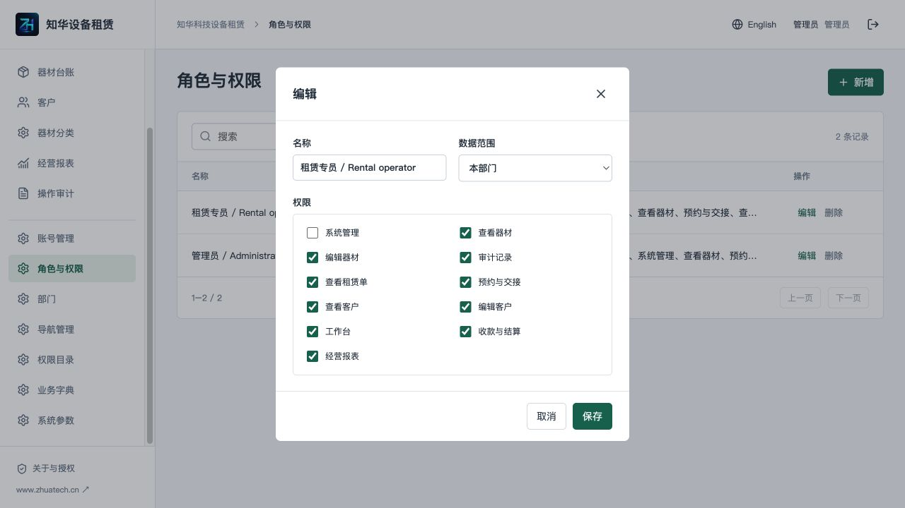
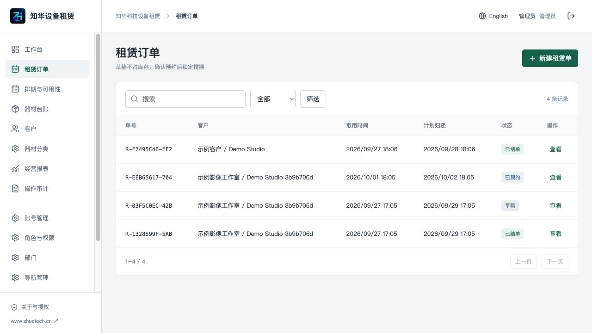

<p></p>

# 知华科技设备租赁 · ZhuaTech Rental

**公开源码学习版 / Non-commercial source edition**

适合摄影器材、灯光音响及小型设备租赁团队学习和评估：按设备序列号预约，核对付款后出库，逐台归还验收，最后结清费用和押金。企业使用、实施交付与商业二次开发需事先取得书面授权。

上海如静知华信息科技有限公司 · [知华科技官网](https://www.zhuatech.cn/) · 微信 `zhuatech` / `zhuatech2`。

English readers: [English guide](docs/ENGLISH.md). Both Chinese and English interfaces are included.

## 从一张租赁单到完成结算

1. 建立器材分类、设备序列号、日租金、押金和附件清单，添加客户。
2. 选择取用与归还时间，查询可用器材，保存报价草稿。
3. 确认预约。服务器锁定设备后再次检查冲突；草稿不占库存。
4. 核对实际付款凭据，分别登记费用和押金，执行出库交接，打印交接单。
5. 逐台归还，记录附件和功能检查、损坏赔偿；未通过验收的设备留在检修状态。
6. 结清新增费用，必要时从押金扣抵，登记押金退款，完成结单。

单台归还不会释放仍在外面的其他器材。逾期未还的设备继续阻塞后续预约。设备归还后仍有周转缓冲，检修器材须经人工验收释放。确认、出库、归还和财务记录使用幂等请求，重复提交不会重复入账。

## 功能范围

| 业务端 | 管理端 |
| --- | --- |
| 工作台、租赁订单、预约冲突查询、出库与打印交接单 | 登录账号启停、密码重置、角色管理、权限分配 |
| 按台归还、验收、逾期费用、损坏赔偿、检修与释放 | 部门与数据范围、内建导航名称/顺序/启停/权限配置 |
| 客户、分类、器材的新增修改删除、搜索筛选分页排序 | 权限目录名称维护、检查字典维护、系统参数 |
| 费用与押金分账、退款凭据、结单、CSV 经营报表 | 操作审计、会话认证、BCrypt、接口和部门权限 |

内建权限代码和页面路径由业务接口定义，管理员可以分配权限及配置现有菜单，不能创建一个无对应业务接口的权限或页面。单公司、按部门控制数据；不提供多商户 SaaS 租户隔离。被历史单据引用的客户、分类和设备不能删除。

**未包含**：线上支付网关、电子签名、税务发票、多商户、外租转租、数量型无序列号库存、人员运输排班、部分归还后的整单续租、法务合同管理。收付款只是人工核对后的台账，不能代替支付交易。未配置任何付费 AI 或外部网关也可运行核心流程。

适用于小型租赁团队的学习评估；列表检索上限为每种资源 10,000 条，业务选择器加载有界主数据。更大规模须先扩展数据库分页、监控、性能验收及灾备。

## 当前页面

以下图片来自本项目实际运行的页面，数据为虚构学习数据。

| 登录 | 业务端工作台 |
| --- | --- |
|  |  |

| 租赁业务 | 后台账号 |
| --- | --- |
|  |  |

| 经营统计 | 角色与权限 |
| --- | --- |
|  |  |

订单列表与英文统计：




## 运行环境与工程

Java **21**、Spring Boot **4.0.7**、Spring Security、Spring Data JPA；Vue **3.5.40**、Vite **8.1.5**、Node.js **24.19.0 或以上**；MySQL **8.4**；Flyway 版本迁移；Docker Compose v2；Nginx **1.29**。依赖精确版本见 Maven 和前端锁文件。

浏览器 → Nginx 同源 `/api` → Spring Boot → MySQL。浏览器持有 HttpOnly 会话 Cookie，写请求需 CSRF。业务权限和部门范围均在后端核验，权限撤销与账号禁用即时生效。

```text
backend/          Java 应用、计费规则、业务服务与集成测试
  src/main/resources/db/migration/   版本化数据库脚本
frontend/         中英文 Vue 操作端与 Nginx
docs/             操作、接口、数据库、部署、英文说明与真实截图
scripts/          质量检查及发布检查
compose.yaml      MySQL → 后端 → 前端健康依赖
.env.example      安全配置字段示例
LICENSE           自有代码的非商业源码许可证
```

数据库保存账号、角色、权限、菜单、部门、客户、分类、设备、订单、单台明细、收付款台账、审计、参数、字典和幂等记录。JPA 只验证表结构；Flyway `V1__rental_schema.sql` 建表和索引，应用幂等创建内建权限与初始账号，不依赖外部已有数据库。

## Docker 一键启动

```sh
cp .env.example .env
# 编辑 .env，设置三个独立强密码：数据库 root、数据库业务账号和管理员。
docker compose up -d --build --wait
```

首次空库登录账号默认为 **admin**，密码为自行填写的 **ADMIN_PASSWORD**（12–72 位，包含大小写字母和数字），源码没有通用默认密码。首次创建后修改环境变量不会重置已有管理员密码，请通过账号管理或“修改密码”操作。重启不会覆盖现有数据。

前端：`http://127.0.0.1:8095/`。健康：`http://127.0.0.1:8095/actuator/health`。数据库和后端不向宿主机公开端口。端口冲突在 `.env` 设置 `WEB_PORT`，再启动；不要关闭其他项目。

设置 `SEED_DEMO=true` 只会在首次空库启动时创建虚构客户与九台摄影/灯光/音响器材，不创建真实付款、不提供固定弱密码。首次启动后可创建业务账号和部门，使用业务账号验证权限范围。测试必须使用独立 Compose 项目名和全新数据卷。

## 配置与本地开发

| 字段 | 用途 |
| --- | --- |
| `MYSQL_ROOT_PASSWORD` | MySQL 初始化 root 密码，必填，不公开 |
| `DATABASE_PASSWORD` | 数据库业务密码，必填，不公开 |
| `ADMIN_USERNAME` / `ADMIN_PASSWORD` | 首次初始化账号和强密码 |
| `SEED_DEMO` | 首次空库是否加入虚构学习数据，默认 false |
| `WEB_PORT` / `BIND_ADDRESS` | 访问端口与监听地址，默认 8095 / 127.0.0.1 |
| `COOKIE_SECURE` | HTTPS 环境设置 true；本地 HTTP 设置 false |
| `DATABASE_URL` / `DATABASE_USER` | 数据库地址（Compose 同样可覆盖）及直接运行时账号 |

业务参数在管理员“系统参数”维护：公司名称、显示时区、ISO 币种和 0–168 小时周转缓冲。订单创建时保留币种、日租金、押金和缓冲快照；修改器材新价格不会改旧报价。币种切换不进行汇率换算，需要核对器材日租金和押金的币种含义后再开单。不同币种的统计分开显示。

本地开发先启动 MySQL，配置上述后端环境变量后：

```sh
cd backend
mvn spring-boot:run
# 另开终端
cd frontend
npm ci
npm run dev
```

开发前端默认 `http://127.0.0.1:5173`，仅开发代理转发到本地后端 8080；部署构建使用 Nginx 服务名。不存在把本地地址写进生产静态包的配置。

数据库使用 MySQL 8.4，连接驱动为 MariaDB Connector/J 3.5.10（LGPL 2.1）。容器内网的 TLS 设置与外部数据库证书校验见 [部署手册](docs/DEPLOYMENT.md#数据库驱动与-tls)。

## 操作、数据库与接口

- [租赁操作手册](docs/OPERATIONS.md)：计费、验收、续租、押金、取消与结单。
- [部署与备份恢复](docs/DEPLOYMENT.md)：HTTPS、数据卷、升级、备份与故障处理。
- [接口和数据库说明](docs/ARCHITECTURE.md)：权限、状态、表、索引、接口及并发边界。
- [第三方依赖说明](docs/THIRD_PARTY.md)：依赖版权和许可证。

输入租期使用浏览器所在时区，界面明确显示输入时区；列表按公司配置的时区显示。日租计费按每 24 小时向上取整，跨夏令时仍使用持续时长，不按日历日期猜测。部分归还后不能整单续租，请建立新单。金额统一保留两位小数，不能用于要求三位币种小数或税务专用舍入的场景。

## 检查与验收

```sh
cd backend
mvn spotless:check test package
cd ../frontend
npm ci
npm run format:check
npm run lint
npm test
npm run build
cd ..
docker compose config --quiet
docker compose -p rental-check up -d --build --wait
python3 scripts/release-check.py
git diff --check
```

单元测试覆盖租金、边界区间、逾期、金额与 CSV 公式防护；集成测试覆盖真实 HTTP 登录/CSRF、账号和数据权限、冲突预订、并发确认、价格快照、收退款幂等、归还与结单。自动测试使用 H2 MySQL 兼容模式；43 项后端测试及 4 项前端测试通过。另在全新 MySQL 8.4 数据卷验证了迁移、49 项 HTTP 检查、完整界面操作、重启持久化及独立数据库备份恢复。公共部署、真实支付渠道和大型并发负载尚未验收。

## 安全、升级与反馈

`.env`、构建产物、依赖目录和运行日志均不提交。部署前配置 HTTPS 与 `COOKIE_SECURE=true`，保持默认仅本机监听，通过自己的安全反向代理开放；不能直接将学习环境作为互联网公共演示，不共享管理员账户。会话 30 分钟超时；登录失败有单进程限流；多实例及公共演示须另行配置统一会话、网关限流和隔离的演示数据。

升级前备份数据库，新增迁移文件，不修改已经执行的迁移；启动时 Flyway 自动应用新版迁移。禁止执行 `down -v` 清理真实业务卷。测试资源只清理明确用于本次测试的项目。

常见问题：健康失败先检查数据库密码和容器日志；首次登录失败检查初始化密码、是否已有数据库和账号是否禁用；写接口 403 检查权限和 CSRF；409 冲突核对库存占用、周转、维修、账单状态或记录引用。发生网络超时先核对台账，再使用同一幂等请求重试，避免另建一次实际支付。

问题反馈和贡献使用仓库 Issues/PR（上传前移除客户数据、凭证和日志中的隐私）。安全漏洞请通过官网或咨询微信私下反馈，不在公开 Issues 发布攻击步骤及敏感数据。贡献应包含业务说明、合适的测试和依赖授权说明。软件按现状提供；最终交付范围、适用性与商业服务以书面协议为准。

## 联系知华科技

本项目由知华科技（上海如静知华信息科技有限公司）提供公开源码学习版本，主要用于个人学习、技术研究与非商业交流。未经书面授权不得商用。企业信息化建设、中小企业数字化转型、中小企业 AI 转型、私有化部署、软件外包、软件项目外包、软件实施、FDE 外包、OPC 技术支持及深度定制开发，请访问知华科技官网 <https://www.zhuatech.cn/>，或添加微信 zhuatech、zhuatech2 咨询。

自有代码以根目录 [LICENSE](LICENSE) 为准；这不是 OSI 标准开源项目。第三方依赖保持各自版权和许可。

<table><tr><td align="center"><br>微信：zhuatech</td><td align="center"><br>微信：zhuatech2</td></tr></table>
