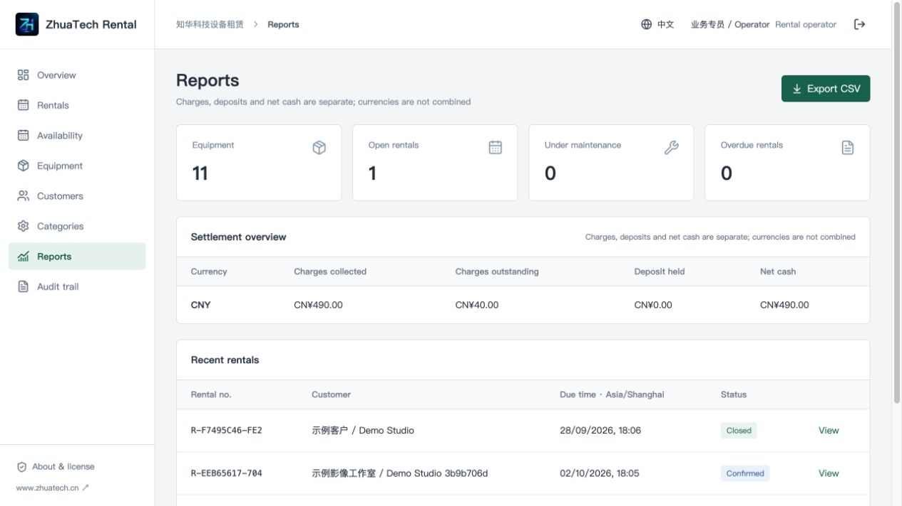

# ZhuaTech Rental — equipment rental operations

Non-commercial source edition. Copyright Shanghai Rujing Zhihua Information Technology Co., Ltd. (上海如静知华信息科技有限公司). Website: https://www.zhuatech.cn/. Commercial licensing, customization, deployment and integration: WeChat **zhuatech / zhuatech2**.

## Who it is for

Camera, lighting, AV and small equipment rental teams evaluating a self-hosted, serialized-equipment workflow. The browser interface includes Chinese and English. This is one company per deployment, with department-based access. It is not a multi-merchant marketplace.

Set up customers, equipment categories, unique equipment codes, daily rates, deposits and accessories. Select the pickup/return period, check availability and save a quote draft. Confirm to reserve equipment; simultaneous confirmations for the same equipment cannot both succeed. Record verified charge and deposit receipts separately, check out, print the handover sheet and check in each item with inspection notes. Failed inspection holds an item for maintenance. Settle extra charges, apply deposits if agreed, record the refund and close the rental with zero outstanding charges and deposit.

Billing uses elapsed 24-hour periods rounded up. Overdue returns add daily charges. Turnaround hours remain blocked after return. A partially returned order still reserves the items that are out. An overdue item remains blocked until physically returned. Extension rechecks future reservations; after partial return, create a new rental for remaining items instead. Damage charges require manual agreement and a recorded amount.

Money uses two decimals. Configure an ISO currency and display time zone in settings. Quotes snapshot currency, rates, deposits and turnaround rules. Changing currency does not convert existing prices or exchange money. Reports keep currencies separate; deposits are liabilities, not revenue. Net cash and collected charges are not profit.

## Run it

Requirements: Docker Compose v2, MySQL 8.4; Java 21 / Spring Boot 4.0.7 backend and Node 24.19+ / Vue 3 frontend for direct development.

```sh
cp .env.example .env
# Set independent strong database and administrator passwords.
docker compose up -d --build --wait
```

Open `http://127.0.0.1:8095`. Login is `ADMIN_USERNAME` (default admin) and the strong `ADMIN_PASSWORD` you configured. No shared default password exists. The password must contain uppercase, lowercase and digits, 12–72 characters. Changing this environment variable later does not reset an existing account. Set `SEED_DEMO=true` only on a fresh learning database to create fictional equipment and customers.

The input time zone is the browser time zone, displayed beside the inputs; existing timestamps display in the configured company zone. Use HTTPS and secure cookies for business deployment. Database and application ports remain internal. Use WEB_PORT to avoid conflicts. Follow the deployment guide for backups and upgrades; never delete your real data volume.

## Scope and license

Account, role, permission allocation, registered menu configuration, department scope, dictionaries, settings and immutable audit are implemented. Search/filter/pagination operates over bounded resource sets of 10,000 rows; larger deployments require database pagination and performance acceptance. This release is intended for small-team learning and evaluation, without a production load guarantee.

Payment entries are a manual ledger after actual receipts/refunds have been verified. Online gateways, e-signatures, tax invoices, subrentals, bulk non-serialized inventory, vehicle/crew scheduling and multi-tenant SaaS are not included. No external paid provider is required for the core workflow.

Personal learning, research and non-commercial exchange only; written authorization is required for commercial use, business deployment, paid delivery, SaaS, source resale and commercial customization. Keep attribution and LICENSE. This is not an OSI-approved open-source license. Third-party dependencies retain their original licenses. See root LICENSE and the two original WeChat QR codes in README.

Report reproducible defects through repository Issues, without customer data or credentials. Report security issues privately through the website or the listed WeChat contacts. Contributions should include business context, tests and dependency licensing. Software is provided as-is; commercial services and delivery scope are agreed in writing.

## Interface preview


Mobile layout (390 px browser viewport; wide tables scroll within their panel):


